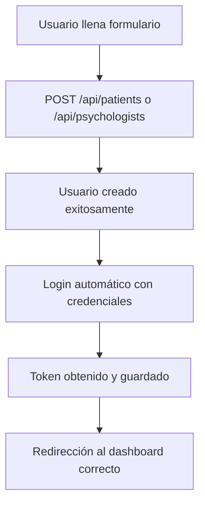
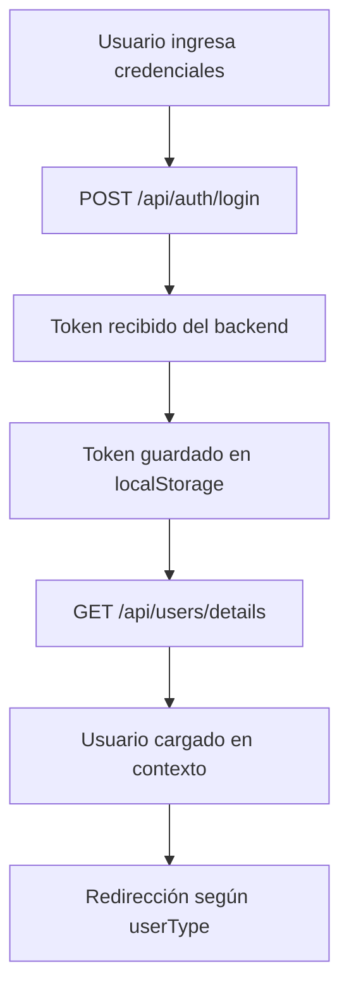
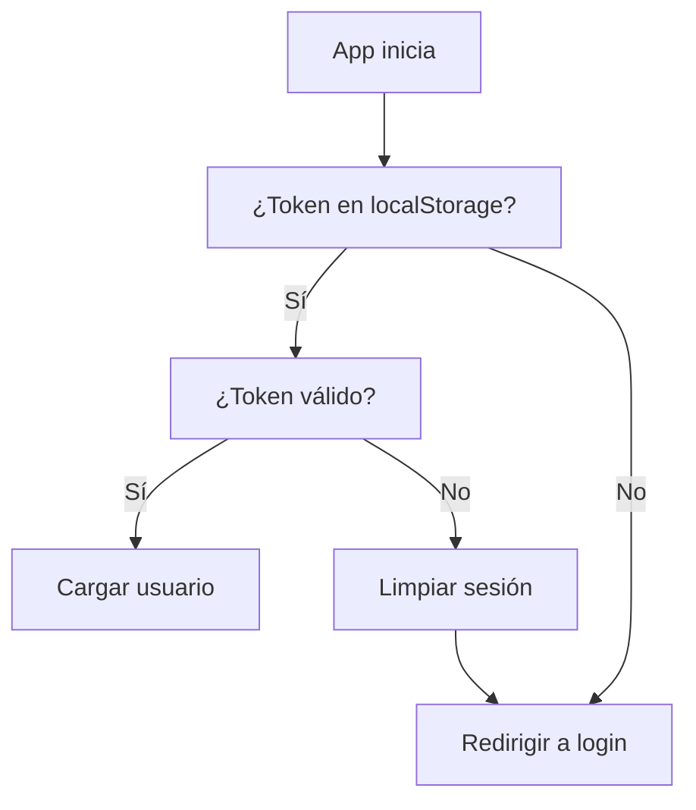

# 🔐 Guía de Manejo de Sesiones y Tokens - Empathica

## 📋 Tabla de Contenidos

1. [Descripción General](#descripción-general)
2. [Arquitectura del Sistema](#arquitectura-del-sistema)
3. [Componentes Principales](#componentes-principales)
4. [Flujo de Autenticación](#flujo-de-autenticación)
5. [Protecciones de Seguridad](#protecciones-de-seguridad)
6. [Manejo de Errores](#manejo-de-errores)
7. [Configuración](#configuración)
8. [Troubleshooting](#troubleshooting)

---

## 🎯 Descripción General

El sistema de manejo de sesiones y tokens de Empathica está diseñado para proporcionar una experiencia de usuario segura y fluida, evitando problemas comunes como sesiones mezcladas, tokens obsoletos y accesos no autorizados.

### 🎯 Objetivos del Sistema

- ✅ **Prevenir sesiones mezcladas** entre diferentes usuarios
- ✅ **Manejar automáticamente la expiración de tokens**
- ✅ **Limpiar sesiones en escenarios de cierre/error**
- ✅ **Proporcionar timeout por inactividad**
- ✅ **Alertar al usuario antes de la expiración**
- ✅ **Mantener la seguridad sin comprometer la UX**

---

## 🏗️ Arquitectura del Sistema

### 📁 Estructura de Archivos

```
src/
├── contexts/
│   └── AuthContext.jsx          # Contexto principal de autenticación
├── services/
│   └── api.js                   # Servicios API con interceptores
├── hooks/
│   └── useSessionTimeout.js     # Hook para timeout de sesión
├── components/
│   ├── SessionTimeoutAlert.jsx  # Alerta de expiración
│   ├── PsychologistDashboard.jsx
│   ├── ClientDashboard.jsx
│   └── BusinessDashboard.jsx
```

### 🔄 Flujo de Datos

```
Usuario → Login → Token JWT → localStorage → Interceptores → API Calls
   ↓
Contexto → Estado Global → Componentes → Timeout/Alertas
```

---

## 🧩 Componentes Principales

### 1. **AuthContext.jsx** - Contexto de Autenticación

**Responsabilidades:**
- Gestión del estado global de autenticación
- Mapeo de roles del backend a tipos de usuario
- Limpieza automática de sesiones
- Event listeners para cierre de ventana

**Funciones Principales:**

```javascript
// Login con limpieza automática de sesión anterior
const login = async (credentials) => {
  // 1. Limpiar sesión anterior
  clearSession();
  
  // 2. Hacer login
  const response = await authService.login(credentials);
  
  // 3. Obtener detalles del usuario
  const userDetails = await userService.getUserDetails();
  
  // 4. Mapear roles y guardar
  const userWithType = mapUserRolesToType(userDetails);
  setUser(userWithType);
};

// Limpieza completa de sesión
const clearSession = () => {
  localStorage.removeItem('empathica_token');
  localStorage.removeItem('empathica_user');
  setUser(null);
};
```

### 2. **api.js** - Servicios API con Interceptores

**Interceptores Implementados:**

#### Request Interceptor
```javascript
apiClient.interceptors.request.use((config) => {
  // Verificar expiración del token antes de cada request
  if (isTokenExpired()) {
    clearSession();
    window.location.href = '/login';
    return Promise.reject(new Error('Token expirado'));
  }
  
  // Agregar token a headers
  const token = localStorage.getItem('empathica_token');
  if (token) {
    config.headers.Authorization = `Bearer ${token}`;
  }
  return config;
});
```

#### Response Interceptor
```javascript
apiClient.interceptors.response.use(
  (response) => response,
  (error) => {
    if (error.response?.status === 401) {
      // Token expirado o inválido
      clearSession();
      window.location.href = '/login';
    } else if (error.response?.status === 403) {
      // Acceso denegado
      clearSession();
      window.location.href = '/login';
    }
    return Promise.reject(error);
  }
);
```

### 3. **useSessionTimeout.js** - Hook de Timeout

**Funcionalidades:**
- Timeout por inactividad (60 minutos por defecto)
- Reset automático con actividad del usuario
- Event listeners para mouse, teclado, scroll, touch

```javascript
export const useSessionTimeout = (timeoutMinutes = 60) => {
  const { clearSession } = useAuth();
  
  const resetTimeout = () => {
    // Resetear timeout con actividad del usuario
    clearTimeout(timeoutRef.current);
    timeoutRef.current = setTimeout(() => {
      clearSession();
      window.location.href = '/login';
    }, timeoutMinutes * 60 * 1000);
  };
  
  // Eventos que resetean el timeout
  const events = ['mousedown', 'mousemove', 'keypress', 'scroll', 'touchstart', 'click'];
};
```

### 4. **SessionTimeoutAlert.jsx** - Alerta de Expiración

**Características:**
- Alerta 5 minutos antes de la expiración
- Countdown en tiempo real
- Opciones para extender o cerrar sesión
- Modal overlay con z-index alto

---

## 🔄 Flujo de Autenticación

### 1. **Registro de Usuario**



### 2. **Login Manual**



### 3. **Verificación de Sesión**



---

## 🛡️ Protecciones de Seguridad

### 1. **Limpieza Automática de Tokens**

#### Escenarios de Limpieza:
- ✅ **Cierre de ventana/pestaña** (`beforeunload`)
- ✅ **Página oculta por 30+ minutos** (`visibilitychange`)
- ✅ **Errores 401/403** (Interceptores de respuesta)
- ✅ **Token expirado** (Verificación JWT)
- ✅ **Logout manual** (Función logout)

#### Implementación:
```javascript
// Event listener para cierre de ventana
window.addEventListener('beforeunload', () => {
  clearSession();
});

// Event listener para visibilidad
document.addEventListener('visibilitychange', () => {
  if (document.hidden) {
    setTimeout(() => {
      if (document.hidden) {
        clearSession();
      }
    }, 30 * 60 * 1000); // 30 minutos
  }
});
```

### 2. **Verificación de Expiración JWT**

```javascript
const isTokenExpired = () => {
  const token = localStorage.getItem('empathica_token');
  if (!token) return true;
  
  try {
    const payload = JSON.parse(atob(token.split('.')[1]));
    const currentTime = Math.floor(Date.now() / 1000);
    
    // Margen de seguridad de 5 minutos
    return payload.exp < (currentTime - 300);
  } catch (error) {
    return true; // Si hay error, considerar como expirado
  }
};
```

### 3. **Timeout por Inactividad**

- **Tiempo de inactividad**: 60 minutos
- **Alerta previa**: 5 minutos antes
- **Eventos que resetean**: Mouse, teclado, scroll, touch, click
- **Acción automática**: Limpieza de sesión y redirección

### 4. **Mapeo Seguro de Roles**

```javascript
const mapUserRolesToType = (userDetails) => {
  let userType = 'client'; // Por defecto seguro
  
  if (userDetails.roles && userDetails.roles.length > 0) {
    const role = userDetails.roles[0];
    
    if (role === 'PSYCHOLOGIST') {
      userType = 'psychologist';
    } else if (role === 'ADMIN') {
      userType = 'business';
    } else if (role === 'PATIENT') {
      userType = 'client';
    }
  }
  
  return {
    ...userDetails,
    userType: userType,
    id: userDetails.userId || userDetails.id
  };
};
```

---

## ⚠️ Manejo de Errores

### 1. **Errores de Autenticación**

| Código | Descripción | Acción |
|--------|-------------|--------|
| 401 | Token expirado o inválido | Limpiar sesión, redirigir a login |
| 403 | Acceso denegado | Limpiar sesión, redirigir a login |
| 500 | Error del servidor | Mostrar mensaje de error |

### 2. **Errores de Red**

```javascript
// Interceptor de respuesta
apiClient.interceptors.response.use(
  (response) => response,
  (error) => {
    if (error.response?.status === 401) {
      console.log('Token expirado o inválido, limpiando sesión...');
      clearSession();
      window.location.href = '/login';
    }
    return Promise.reject(error);
  }
);
```

### 3. **Errores de Token**

- **Token malformado**: Se considera expirado
- **Token no encontrado**: Redirección a login
- **Error de decodificación**: Limpieza automática

---

## ⚙️ Configuración

### 1. **Timeouts Configurables**

```javascript
// En los dashboards
useSessionTimeout(60); // 60 minutos de inactividad

// En SessionTimeoutAlert
<SessionTimeoutAlert 
  warningMinutes={5}    // Alerta 5 minutos antes
  timeoutMinutes={60}   // Timeout total de 60 minutos
/>
```

### 2. **Event Listeners**

```javascript
// Eventos que resetean el timeout
const events = [
  'mousedown',
  'mousemove', 
  'keypress',
  'scroll',
  'touchstart',
  'click'
];
```

### 3. **Margen de Seguridad**

```javascript
// 5 minutos de margen para expiración de token
return payload.exp < (currentTime - 300);
```

---

## 🔧 Troubleshooting

### 1. **Problema: Sesiones Mezcladas**

**Síntomas:**
- Usuario ve datos de otro usuario
- Token incorrecto en localStorage
- Redirecciones incorrectas

**Solución:**
```javascript
// Verificar limpieza en registro
const login = async (credentials) => {
  clearSession(); // Limpiar antes del login
  // ... resto del código
};
```

### 2. **Problema: Token No Se Limpia**

**Síntomas:**
- Token persiste después del logout
- Errores 401 recurrentes
- Usuario no puede hacer logout

**Solución:**
```javascript
// Verificar función clearSession
const clearSession = () => {
  localStorage.removeItem('empathica_token');
  localStorage.removeItem('empathica_user');
  setUser(null);
};
```

### 3. **Problema: Timeout No Funciona**

**Síntomas:**
- Sesión no expira por inactividad
- Alertas no aparecen
- Event listeners no se disparan

**Solución:**
```javascript
// Verificar hook useSessionTimeout
useSessionTimeout(60); // Asegurar que esté importado y usado
```

### 4. **Problema: Interceptores No Responden**

**Síntomas:**
- Peticiones fallan sin limpieza
- Errores 401 sin redirección
- Tokens obsoletos persisten

**Solución:**
```javascript
// Verificar interceptores en api.js
apiClient.interceptors.request.use((config) => {
  if (isTokenExpired()) {
    clearSession();
    return Promise.reject(new Error('Token expirado'));
  }
  // ... resto del código
});
```

---

## 📊 Métricas y Monitoreo

### 1. **Logs de Seguridad**

```javascript
// Logs implementados
console.log('Token expirado, limpiando sesión...');
console.log('Sesión cerrada por inactividad (60 minutos)');
console.log('Usuario deslogueado');
console.log('Sesión completamente limpiada');
```

### 2. **Eventos Rastreables**

- Login exitoso/fallido
- Logout manual/automático
- Timeout por inactividad
- Errores de autenticación
- Limpieza de sesión

---

## 🚀 Mejores Prácticas

### 1. **Seguridad**
- ✅ Siempre limpiar sesión antes de login
- ✅ Verificar expiración en cada request
- ✅ Usar margen de seguridad para tokens
- ✅ Implementar timeout por inactividad

### 2. **UX**
- ✅ Alertar antes de la expiración
- ✅ Permitir extender sesión
- ✅ Redirección automática a login
- ✅ Mensajes de error claros

### 3. **Mantenimiento**
- ✅ Logs detallados para debugging
- ✅ Configuración centralizada
- ✅ Manejo consistente de errores
- ✅ Documentación actualizada

---

## 📝 Notas de Implementación

### Versiones de Dependencias
- React: 18.x
- Axios: Para interceptores HTTP
- localStorage: Para persistencia de tokens

### Compatibilidad
- ✅ Navegadores modernos
- ✅ Dispositivos móviles
- ✅ PWA (Progressive Web App)

### Consideraciones de Rendimiento
- Event listeners con cleanup apropiado
- Timeouts con clearTimeout
- Verificación de token optimizada

---

*Última actualización: Diciembre 2024*
*Versión del documento: 1.0*
